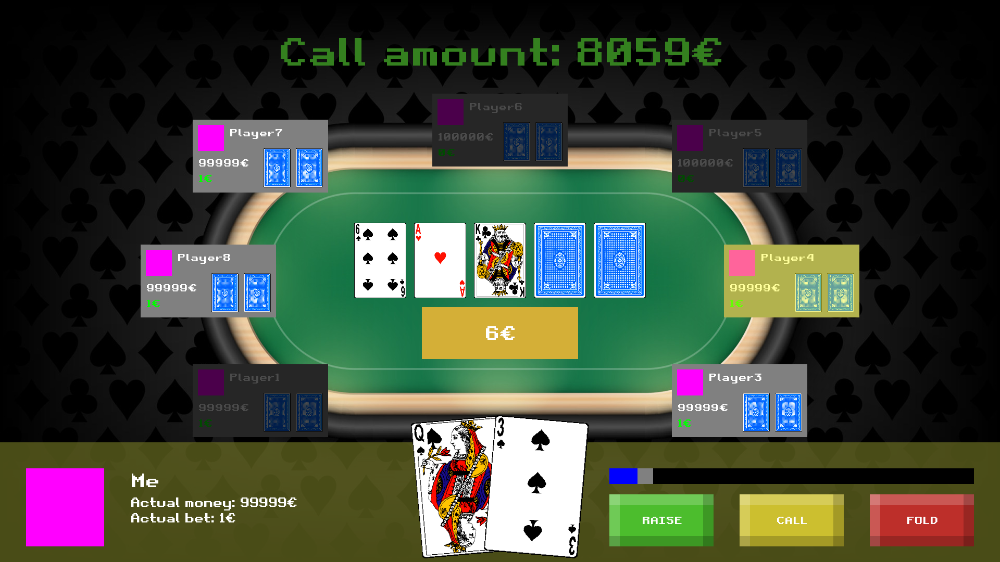

# rust-poker

:warning: This project it's still in early development, so there are bugs

## How to run it

First make sure you installed the Cargo package manager.

Open the folder of the project and run:
```
cargo run
```

Then you should be able to play.

